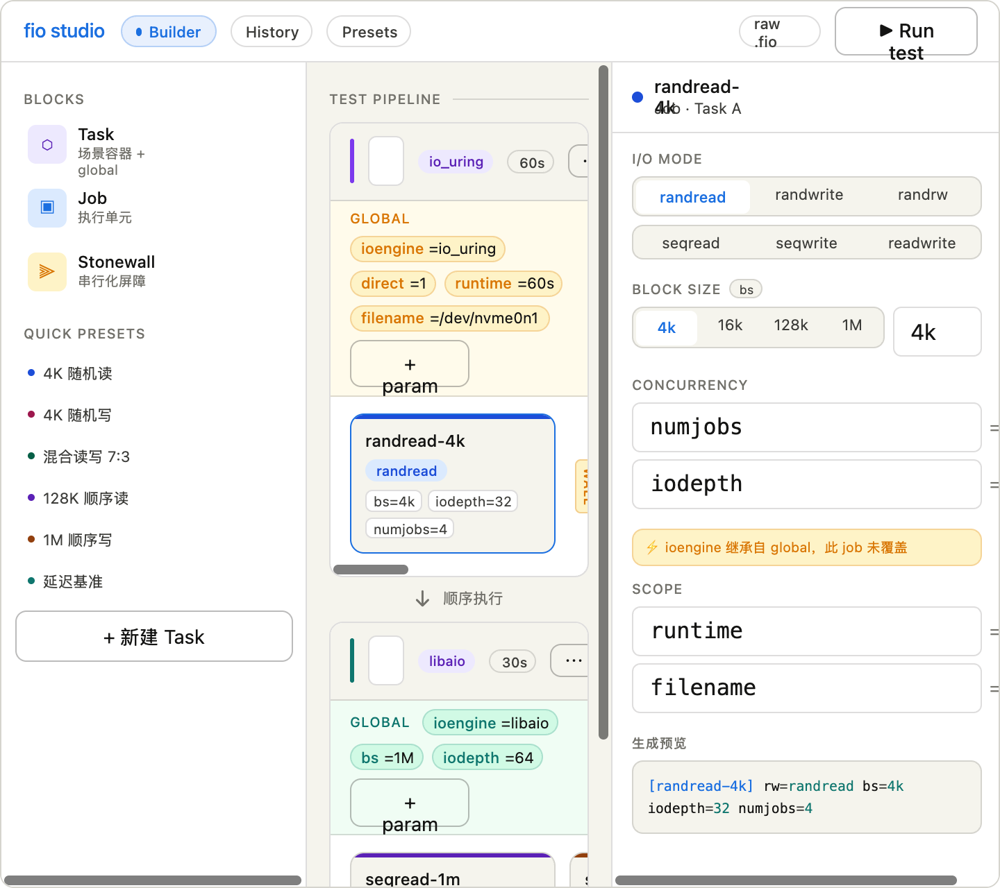

好，现在我对 fio 的数据模型和你的项目架构理解得很清楚了。让我深入思考再下笔。好，信息收集完毕，现在让我深度思考，然后做设计原型。

---

## 产品思维分析

先把 fio 的心智模型梳理清楚，再映射到 UI 设计。

**fio 的核心概念层次：**

```
测试套件 (TaskList)
  └── Task（对应 .fio 文件）
        ├── [global]  ← 全局默认值
        └── [job1], [job2]...  ← 具体执行单元，可继承/覆盖 global
              每个 Job 核心维度：
              - 目标：filename / device
              - 模式：rw (randread/write/randrw...)
              - 引擎：ioengine (libaio/io_uring/sync...)
              - 块大小：bs
              - 并发：numjobs × iodepth
              - 时长：runtime / size
              - stonewall：串行化屏障
```

**你的"积木"直觉非常对——但要深挖 metaphor：**

积木的关键是：每块有**形状语义**（告诉你它能放哪里）+ **可见属性**（告诉你它做什么）+ **叠放关系**（告诉你执行顺序）。

---现在来做完整的 UI 设计原型，这是核心。现在再出一张实时运行态的设计：---



## 设计思想总结

### 为什么是"积木"而非"表单"

你的直觉完全正确，核心矛盾是：fio job file 本质上是**树状嵌套配置** + **线性执行序列**，而普通表单是扁平的。积木隐喻能自然地表达这两个维度：

**三级嵌套对应三种积木形状：**

| 层级 | 积木形状 | 视觉语言 |
|---|---|---|
| TaskList | 底座 / 画布 | 透明容器，只负责排列 |
| Task | 场景卡片 | 带颜色标识栏 + global 参数条 |
| Job | 方块 | 色块 + rw 徽章 + 参数 pill |
| Stonewall | 分隔符 | 竖线 + 旋转文字，视觉上是"门" |

### 四个核心 UX 原则

**1. global 的"继承可视化"** 是最关键的设计点。fio 最容易出错的地方就是"这个参数到底从哪来"。设计上：global 参数条用琥珀色高亮，job inspector 中如果某参数继承自 global，会显示"继承自 global · 此 job 未覆盖"的提示。一旦 job 覆盖，pill 颜色变成蓝色，表示"本地值"。

**2. stonewall 必须有强烈的视觉隔断感。** 它不是一个属性，它是一道门。现有很多工具把它当 checkbox 处理，用户根本感受不到执行顺序语义。设计上用竖向分隔符（竖线 + 旋转的 "wall" 标签），在 timeline 视图里会显示"waiting for stonewall"的等待态。

**3. 双视图切换：积木 ↔ raw .fio。** 有些用户是老 fio 用户，他们需要直接看 ini 文件。右上角的"raw .fio"按钮直接展开等价的文件内容，两个视图双向同步。Inspector 面板底部也始终显示当前 job 的 ini 片段预览，这是实时反馈——用户在点按钮、选模式时，下面的代码块实时更新，建立操作→配置的认知连接。

**4. 快速预设 + 参数钻取。** 左侧面板有"4K 随机读"等常见 benchmark 模式的一键拖拽预设——这是给不熟悉 fio 的用户的。而右侧 Inspector 允许任何参数的精细覆盖，这是给专家用户的。两条路不冲突。

### 运行态的设计重点

运行视图不是普通监控大屏，核心是**"哪个 job 在运行、stonewall 阻塞了哪些"**的实时叙事。timeline 条显示：蓝色 = 运行中、灰色淡出 = 等待 stonewall、实心 = 完成。这让用户理解"为什么写性能测试还没开始"——因为 stonewall 挡着。

这是 fio webui 目前市场上所有实现都没有做好的一个点。
# Fio Builder / Monitor / Report Redesign

## 背景

当前 Workflow Studio 中的 `Job` 积木块仍然是固定字段模型，只覆盖了 fio 很小一部分参数：

- `rw / bs / iodepth / size / numjobs / filename` 等少数参数直接写死在 job 上。
- fio 的 `[global]` 共享区能力没有体现在 UI 中，导致用户只能在每个 job 里重复填写。
- 同一参数无法自然表达“共享默认值 + job 局部覆盖”的继承关系。
- Monitor 图表的轴标签和单位展示不稳定，带宽和延迟在不同量级下可读性差。
- 报告导出仅是一个非常薄的 HTML 包装，图表、单位、摘要与错误上下文都不足。

## 设计目标

1. 让 Stage 对应 fio task / `[global]` 共享区，Job 只保留“局部覆盖”。
2. 参数编辑从固定表单改为“参数目录 + 继承视图 + 自定义键值”的通用模式。
3. Stage / Job 卡片能快速看出哪些参数来自共享、哪些被 job 覆盖。
4. 监控页与历史详情使用统一的指标单位格式化规则。
5. 导出报告使用与监控一致的数据单位、时间范围和摘要逻辑。

## 交互模式

### 1. Stage 共享参数区

- Stage Inspector 中提供“共享参数”分组面板，覆盖 fio `[global]` 语义。
- 常用参数按目录分组展示：基础参数、IO/引擎、速率/并发、访问分布、高级参数。
- 默认展开高频分组，低频分组折叠。
- 支持搜索参数 key，便于快速定位 fio 选项。
- Stage 中设置的参数默认作用于该 Stage 下所有 Job。

### 2. Job 覆盖参数区

- Job Inspector 不再展示“完整参数副本”，而是展示“覆盖项”。
- 每个字段都能看到：
  - 当前是否继承共享值
  - 若继承，则显示共享值摘要
  - 若覆盖，则允许编辑并可一键恢复为继承
- 卡片头部显示覆盖项数量，帮助用户快速判断该 Job 是否是“轻覆盖”还是“特化 Job”。

### 3. 自定义参数

- 元数据目录外的 fio 参数通过“自定义参数”键值列表补充。
- 共享区和 Job 覆盖区都支持自定义参数。
- 未识别参数直接透传给后端 INI 生成，避免 UI 再次成为 fio 能力上限。

### 4. Stage / Job 摘要

- Stage 卡片显示：模式、共享参数数量、Job 数量。
- Job 卡片显示：`rw / bs / iodepth` 等关键有效值，以及覆盖项数量。
- 摘要中的值来自“共享 + 覆盖”解析后的有效参数，而不是只读本地 patch。

### 5. Monitor / Report 指标表达

- IOPS：按 `KIOPS / MIOPS` 自动缩放。
- 带宽：以 `MiB/s / GiB/s` 为主，明确使用二进制单位。
- 延迟：根据量级在 `us / ms / s` 之间切换。
- 时间轴统一展示相对运行时长，图例与悬浮值使用同一格式化逻辑。

## TDD TODO

### 参数建模

- [x] 为前端 Builder 引入通用 `FioParameterValue / FioParameterMap`。
- [x] 将 Stage 改为共享参数容器，Job 改为覆盖参数容器。
- [x] 为参数元数据补充 scope / override 能力映射。
- [x] 增加“共享 + 覆盖 -> 有效参数”的纯函数测试。
- [x] 增加“编译为 FioTaskList”时的继承/stonewall/自定义参数测试。

### 后端 fio 生成

- [x] 为 `GlobalConfig / JobConfig` 增加自定义参数透传能力。
- [ ] 重写 INI 生成逻辑，使共享参数写入 `[global]`，覆盖参数写入 job 段。
- [x] 增加任意参数、布尔参数、共享覆盖冲突的单测。

### Workflow Studio UI

- [x] 重构 `InspectorPanel` 为“Stage 共享参数 + Job 覆盖参数”双层编辑器。
- [x] 在 Job 级别支持“恢复继承”与覆盖计数。
- [x] 在 Stage / Job 卡片上展示有效值摘要。
- [x] 支持共享区与覆盖区的自定义参数键值对。

### Monitor / History / Report

- [x] 抽取统一的 stats 单位格式化与时间范围过滤工具。
- [x] 修正 `StatsChart` 轴标题、刻度值、图例值单位。
- [x] Monitor / History 统一使用同一组格式化逻辑。
- [x] 重新设计导出报告模板，补齐概览、图表、配置、错误摘要。
- [x] 报告导出接口使用统一 view 配置与正确单位标签。

### 验证

- [x] `vitest` 覆盖参数继承、格式化、过滤逻辑。
- [x] `go test` 覆盖 INI 生成、报告 view、报告导出。
- [x] `npm run build` 与 `go build` 通过。
